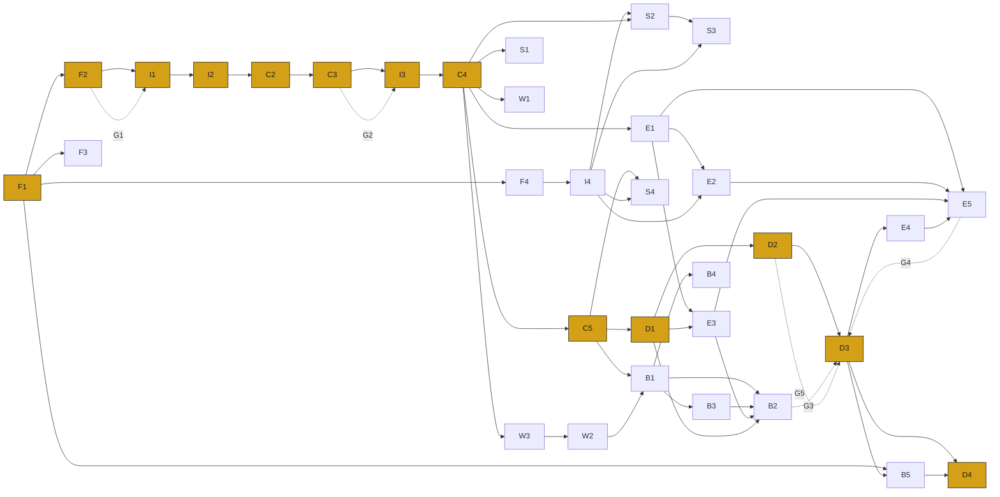

# Failure-Demand App — Dependency-Mapped Delivery Plan

**The entire approach reconstructed as a set of tracked analysis units.** Each unit lists its inputs (and their source), the analysis process, the output/product it produces, what it depends on, and how it is tracked. Dependencies are mapped end-to-end so blockers are visible early and delays to the plan are minimised.

**How to read this**
- Every unit has an **ID** (e.g. `C4`) used for dependency references.
- **Depends on** lists the upstream IDs that must reach *Done* (or a defined partial state) first.
- **Tracked by** gives the completion criterion (when it counts as Done) and a health signal (what tells you it is drifting).
- **Gates** (G0–G6) are hard decision points; work downstream of a gate does not start until the gate is passed.

---

## 1. Tracking model

| State | Meaning |
|---|---|
| ⚪ Not started | Predecessors not yet met. |
| 🟡 In progress | Active; on track. |
| 🔵 Blocked | Waiting on a named dependency or gate. |
| 🟢 Done | Completion criterion met and evidenced. |

**Gates (hard decision points):**

| Gate | Criterion to pass | Guards against |
|---|---|---|
| **G0** Mandate & baseline | Scope, sponsor, baseline & measures agreed | Building without a target |
| **G1** IG cleared | DPIA + anonymisation design signed off | PII landing before it is safe / re-work |
| **G2** Pilot go/no-go | Taxonomy validated, model accuracy acceptable | Classifying 50k against a flawed framework |
| **G3** Investment decision | Options appraised, business case approved | Building the wrong thing |
| **G4** Equalities cleared | EqIA + accessibility sign-off | Harming excluded residents |
| **G5** Go-live | Prototype tested, delivery ready | Shipping a solution that still fails |
| **G6** Benefits signed off | Actuals evidenced vs baseline | Claiming un-banked savings |

---

## 2. Analysis register

### Workstream F — Foundation

| ID | Inputs (source) | Analysis process | Output | Depends on | Tracked by |
|---|---|---|---|---|---|
| **F1** | Contact-centre MI, service catalogue, leadership priorities | Agree scope, channels, definition of failure demand, baseline & success measures | Mandate + **baseline pack** + measurement plan → **G0** | — | G0 signed; baseline figures agreed by ops leads |
| **F2** | Data flows, retention policy, AI processing description | Complete DPIA; design anonymise-on-ingest; ethics review | **DPIA + anonymisation design** → **G1** | F1 | G1 signed by IG; *health: IG turnaround time* |
| **F3** | GA4, site-search, existing web analytics | Pull already-available web signal as early hypotheses | Early web-demand hypotheses | F1 | Top failed journeys listed; *runs in parallel — no blocker* |
| **F4** | Sample metadata, CRM/case data schema | Data-quality & availability assessment (completeness, tagging, join keys) | Data-readiness report | F1 | Join keys confirmed viable; *health: % records with usable identifier* |

### Workstream I — Ingest & joins

| ID | Inputs (source) | Analysis process | Output | Depends on | Tracked by |
|---|---|---|---|---|---|
| **I1** | 8x8 API (transcripts + metadata) | Build extraction pipeline with **anonymise-on-ingest** | Reusable pipeline (P1) + governance layer (P2) | F2 *(G1)* | Pipeline runs end-to-end on a test batch |
| **I2** | I1 pipeline | Pull small **validation sample** | Anonymised sample corpus | I1 | Sample landed; representative of top services |
| **I3** | I1 pipeline | Pull **full 50k corpus** + matched web/email | Full anonymised corpus | I1, **G2** | Full corpus landed & completeness-checked |
| **I4** | Case-management timestamps, IMD/LSOA, cost-to-serve, operational-event calendar | Build external data joins (identity, geo, cost, events) | Joined reference datasets | F4 | Each join validated; *long-pole — start early (§4)* |

### Workstream C — Core analysis

| ID | Inputs (source) | Analysis process | Output | Depends on | Tracked by |
|---|---|---|---|---|---|
| **C1** | Raw contact (in-pipeline) | Redact/anonymise at ingest | Anonymised data (embedded in I1/I2/I3) | I1 | Zero raw PII in analysis store (audited) |
| **C2** | I2 then I3 corpus | De-dup, normalise, tag (service, channel, date, outcome) | Structured corpus | I2 | Corpus tagged & QA'd |
| **C3** | C2 sample + draft taxonomy | **Calibration pilot**: classify sample, build gold-standard set, measure precision/recall, refine taxonomy | Validated taxonomy + accuracy baseline → **G2** | C2(sample) | G2 go/no-go; *health: precision/recall vs threshold* |
| **C4** | I3 full corpus + validated taxonomy | Full classification: driver → root cause → value/failure → prevention | **Classified corpus** | I3, C3 | 100% corpus classified; accuracy re-checked |
| **C5** | C4 + cost-to-serve (I4) + baseline (F1) | Size & rank demand; top-ten services; addressable reduction per driver | **Demand model & insight pack** (P4) | C4, I4, F1 | Insight pack signed off by ops |

### Workstream S — Systems thinking *(enrichment passes on C4)*

| ID | Inputs (source) | Analysis process | Output | Depends on | Tracked by |
|---|---|---|---|---|---|
| **S1** | C4 corpus | **System-conditions classifier** — tag each failure with the system condition that caused it | Systemic-cause Pareto (+ owners) | C4 | Pareto produced; conditions owned |
| **S2** | C4 + identity join (I4) | **Journey-stitching** — reconstruct repeat-contact chains | Failure-demand chains + repeat-contact rate | C4, I4 | Chains built; *health: % contacts matched to a case* |
| **S3** | S2 + case-mgmt timestamps (I4) | **Flow / value-stream reconstruction** | Lead time, right-first-time %, handoffs, rework per top service | S2, I4 | Value-stream maps for top services |
| **S4** | C5 volumes + event calendar (I4) | **Trigger correlation** — contact vs operational events | Demand-trigger map | C5, I4 | Correlations evidenced |

### Workstream E — Equalities *(aggregate-only; covered by DPIA/ethics)*

| ID | Inputs (source) | Analysis process | Output | Depends on | Tracked by |
|---|---|---|---|---|---|
| **E1** | C4 corpus | **Vulnerability/accessibility signal classifier** (population-level) | Vulnerability prevalence overall & by driver | C4 | Prevalence quantified; safeguarding routing defined |
| **E2** | E1 + IMD/LSOA (I4) | **Equalities heat-map** (failure × deprivation) | Differential-failure map | E1, I4 | Heat-map produced |
| **E3** | E1 + candidate interventions (D1) | **Digital-exclusion risk scorer** per intervention | Exclusion risk + "retain assisted route" flags → **G4** | E1, D1 | Every channel-shift scored |
| **E4** | Built forms/content (D3) | **Automated WCAG 2.2 checker** | Accessibility defect list → **G4** | D3 | All top journeys pass |
| **E5** | E1, E2, E3 | **EqIA generator** — assemble evidence into template | Evidence-based **EqIA** → **G4** | E1, E2, E3 | G4 signed |

### Workstream W — Workforce *(enrichment pass + models)*

| ID | Inputs (source) | Analysis process | Output | Depends on | Tracked by |
|---|---|---|---|---|---|
| **W1** | C4 corpus (advisor side) | **Advisor pain-point / knowledge-gap classifier** | Training + KB backlog + QA themes | C4 | Backlog produced |
| **W3** | C4/C5 | **Automation-suitability scorer** per driver | Automatable vs must-stay-human split | C4 | Every top driver scored |
| **W2** | C5 residual demand + AHT + W3 | **Capacity & workforce-shape model** | FTE reshape curve by skill | C5, W3 | Model built; cashable/non-cashable split |
| **W4** | W2 | **Reskilling / redeployment planner** | Workforce transition plan | W2 | Plan ready for consultation |

### Workstream B — Business case

| ID | Inputs (source) | Analysis process | Output | Depends on | Tracked by |
|---|---|---|---|---|---|
| **B1** | C5 + cost-to-serve + W2 FTE | **Benefits calculator** (cashable/non-cashable, ranges) | Benefit model + assumptions register | C5, W2 | Benefits ranged & owned |
| **B4** | B1 + guardrail metrics | **Dis-benefit / gaming risk adjustment** | Risk-adjusted benefits | B1 | Adjustments applied |
| **B3** | B1 + cost data | **Financial model** — NPV, payback, sensitivity/Monte-Carlo | Financial case | B1 | NPV + sensitivity run |
| **B2** | B1, B3, E3, D1 | **Options appraisal** (do-nothing/min/something) | Options comparison → **G3** | B1, B3, E3, D1 | G3 investment decision |

### Workstream D — Design, deliver, realise

| ID | Inputs (source) | Analysis process | Output | Depends on | Tracked by |
|---|---|---|---|---|---|
| **D1** | C5, S1, S3 | Design prevention actions; prioritise (WSJF/impact-effort); write requirements | **Intervention backlog** (P5) | C5, S1, S3 | Backlog prioritised & owned |
| **D2** | D1 | **Prototype & test with users** (Alpha) | Validated designs → **G5** | D1 | Tested; pass criteria met |
| **D3** | D2, **G3**, **G4** | Build & deploy: IVR, web content, forms, omni-channel, RPA, cross-skilling | Live interventions | D2, B2*(G3)*, E5*(G4)*, **G5** | Go-live; adoption tracked |
| **D4** | D3 + re-run pipeline (I1) | Measure vs baseline; QA; check channel-shift; **re-baseline** | Benefits report + refreshed backlog → **G6** | D3, B5 | G6 signed; sustained reduction |
| **B5** | F1 baseline + D3 actuals | **Benefits-realisation tracker** | Live benefits dashboard | F1, D3 | Baseline→target→actual tracked |

---

## 3. Dependency map

The **gold path** is the critical path — the longest chain that sets the minimum end-to-end duration. Everything off it (S, E, W, B) is float that should run in parallel and must be *ready before its gate*, not on the critical path itself.

---

## 4. Critical path, long-poles & how delays are minimised

**Critical path:** `F1 → F2 → I1 → I2 → C2 → C3 → I3 → C4 → C5 → D1 → D2 → D3 → D4`.
Protect this chain first; a slip on any of these slips the whole plan.

**The four things most likely to cause delay — and the mitigation built into the plan:**

| # | Long-pole / failure risk | Impact | Mitigation |
|---|---|---|---|
| 1 | **IG / DPIA sign-off (F2 → G1)** is the classic blocker; if it lands after extraction it forces re-work | Blocks all ingest | Start day 1; anonymise-on-ingest so the risk profile is low; treat G1 as the first hard gate |
| 2 | **External joins (I4)** — case-management access & identity-match quality are slow and uncertain | Blocks S2, S3, E2, S4 and part of B | **Start I4 in parallel from F4, off the critical path.** If it slips, the core pipeline (C-series) still proceeds; only the systemic/equalities enrichment waits — it never blocks go-live-critical work |
| 3 | **Pilot accuracy (C3 → G2)** — taxonomy fails validation and the full run would be wasted | Re-work of C4 on 50k | The pilot *is* the mitigation: prove small, gate the scale-up. Never run C4 before G2 |
| 4 | **Equalities & investment gates (E3/E5 → G4, B2 → G3)** feed delivery | Blocks D3 go-live | Sequence E1/E3 and B1/B2 to complete during the D1→D2 window so both gates are green *before* D2 finishes |

**Parallelisation rules (to compress the plan):**
- **F3 and F4/I4 run in parallel with F2/I1** — cheap, and de-risk the long-poles early.
- **The enrichment passes S1, E1, W1, W3 are independent of each other** — all they share is the C4 corpus, so a delay in one never blocks the others. Run them concurrently the moment C4 is Done.
- **B and W build on C5, not on delivery** — the business case and workforce model can be fully built while D1/D2 are still in flight, so G3 is ready when D2 lands.
- **Decouple E3 from E4:** E3 (design-time exclusion scoring) gates the *decision*; E4 (build-time WCAG) gates the *build*. Splitting them means the equalities assessment isn't waiting on code.

**Standard delay-control discipline layered on top:**
- A **RAID log** with each dependency edge as a tracked risk; blocked items (🔵) surfaced at every check-in with the exact predecessor named.
- **Gate reviews** (G0–G6) as the only points where downstream work is authorised — no silent starts on unmet dependencies.
- **A single owner per unit** (the register's implied owner) so no analysis is orphaned between workstreams.

---

## 5. One-line summary

The approach is a short **critical spine** (foundation → ingest → classify → model → design → test → deliver → re-baseline) with four **parallel enrichment arms** (systems, equalities, workforce, business case) that hang off the classified corpus and must each be *ready before their gate*. Delays are minimised by: locking IG first, starting the slow external joins early and off the critical path, proving the model on a pilot before scaling, and building the business-case and equalities evidence in parallel so the investment and equalities gates are green before delivery needs them.
