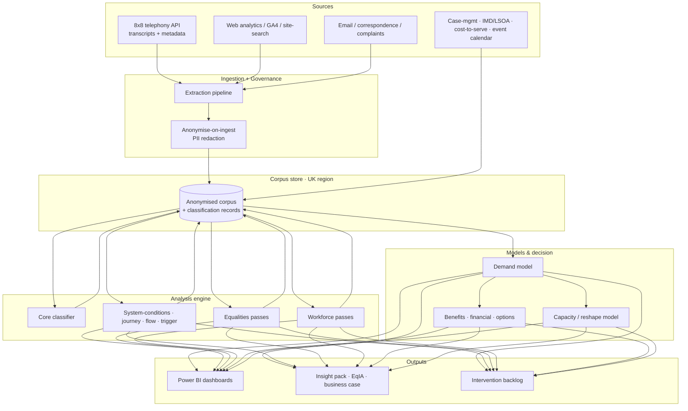

# Failure-Demand App — Forensic Rebuild Specification

**The complete blueprint to rebuild the entire solution from the ground up for the best possible results, maximum efficiency and maximum speed.**

This is the *how*. The roadmap says what to build and in what order; this document specifies each component in forensic detail — architecture, data model, model strategy, every analysis pass (method, prompt design, output schema, validation, throughput), the orchestration that makes it fast, the assurance that makes it defensible, and the accelerated timeline.

---

## 1. Design goals & non-negotiables

| Goal | What it means concretely |
|---|---|
| **Best results** | Every failure-demand driver traced to a *system condition* with an owned prevention action; accuracy measured, not assumed. |
| **Maximum efficiency** | One corpus, many passes. No data re-extraction. Every artefact reused downstream. |
| **Maximum speed** | Bulk work runs concurrently and in batch; re-baselining processes deltas only; the critical spine is protected and everything else parallelised off it. |
| **Defensible** | Anonymise-on-ingest, DPIA-covered, bias-tested, transparent (ATRS), human-in-the-loop on anything consequential. |
| **Repeatable** | The whole pipeline is idempotent and re-runnable on a schedule — an operating capability, not a one-off study. |

**Non-negotiables:** UK data residency; no raw PII in the analysis store; aggregate-only equalities analysis with safeguarding routing; a human validation gate before any full-scale run.

---

## 2. Reference architecture

**Principle:** the corpus store is the single source of truth; every engine pass reads from it and writes its enrichment back to the *same* record, so a record accretes driver → root cause → system condition → vulnerability flags → automatability → cost, and every downstream model reads one joined row.

---

## 3. Environment, stack & data residency

| Layer | Recommended choice | Rationale |
|---|---|---|
| Compute & storage | Azure, UK South region | Aligns with existing M365/SharePoint estate; data residency |
| Language | Python | Ecosystem for data + LLM orchestration |
| LLM access | Claude via API (Anthropic or Azure/Bedrock, UK region) | Best-in-class classification/reasoning; batch + caching support |
| Bulk classification model | **Claude Haiku 4.5** | Fast, low-cost, high-throughput for the 50k pass |
| Judgement passes (system conditions, vulnerability) | **Claude Sonnet 5** | Nuance where it matters |
| Taxonomy design, calibration, adjudication | **Claude Opus 4.8** | Hardest reasoning, done once on small volumes |
| Structured output | Tool-use / JSON-schema enforced | Reliable parsing, no regex scraping |
| Orchestration | Batch API + async concurrency + checkpointing | Throughput and idempotency |
| Dashboards | Power BI | Already in the estate; SRO-friendly |
| Corpus store | Parquet on Azure Blob + a warehouse (e.g. Synapse/Fabric) | Cheap, columnar, re-runnable |

**Data residency & IG:** all inference in-region; DPIA covers AI processing explicitly; an ATRS (Algorithmic Transparency Recording Standard) record is maintained for the public-body transparency duty.

---

## 4. Canonical data model

One record per contact, enriched in place by successive passes:

| Field | Written by | Type |
|---|---|---|
| `contact_id` | Ingestion | string (surrogate) |
| `channel` | Ingestion | enum(call, web, email) |
| `service` | Prep | string |
| `timestamp` | Ingestion | datetime |
| `transcript_clean` | Anonymise/Prep | text (PII-free) |
| `driver` | Core classifier | string (taxonomy) |
| `root_cause` | Core classifier | string |
| `demand_type` | Core classifier | enum(value, failure) |
| `prevention_action` | Core classifier | string |
| `system_condition` | System-conditions pass | enum(library) |
| `journey_id` | Journey-stitching | string (stitched case) |
| `contact_sequence` | Journey-stitching | int |
| `vuln_flags` | Vulnerability pass | array(enum) *(aggregate use only)* |
| `automatability` | Automation-suitability | enum(auto, assisted, human) |
| `cost_to_serve` | Cost join | decimal |
| `imd_decile` | Geo join | int(1–10) |
| `confidence` | Every LLM pass | float |
| `model_version` | Every LLM pass | string |

Immutable `model_version` + `confidence` on every AI-written field is what makes accuracy auditable and drift measurable.

---

## 5. Model strategy — the speed/cost engine

Four levers, applied everywhere:

1. **Tiered models.** Haiku 4.5 for bulk; Sonnet 5 for judgement; Opus 4.8 for design/adjudication. Never use a heavy model for a light job.
2. **Prompt caching.** The taxonomy, system-condition library and instructions are large and *identical* across 50k calls — cache them so only the per-transcript delta is charged/processed. This is the single biggest cost and latency saving.
3. **Batch processing.** Submit the corpus as batch jobs, not synchronous calls — higher throughput, lower cost.
4. **Structured output.** Force a JSON schema via tool-use so every response is parse-clean; malformed rows auto-retry, they don't silently corrupt.

**Indicative throughput** (validate at pilot): 50k transcripts × ~1.5k input tokens, Haiku 4.5 in batch with cached instructions → a full classification run in **hours, not days**, at low cost. Re-baselining processes only new contacts, so it drops to **minutes**.

---

## 6. Forensic module specs

Each spec: **objective · inputs · method · output schema · validation · throughput/speed · failure modes · done criteria.**

### 6.1 Ingestion + anonymise-on-ingest
- **Objective:** land a PII-free corpus, re-runnably.
- **Inputs:** 8x8 API (transcripts + metadata: abandonment, IVR path, CLI hash, repeat flag); web/email exports.
- **Method:** stream from API → redaction (NER for names/addresses/refs + pattern rules for phone/NI/postcode → tokenised placeholders preserving analytical value) → write Parquet. CLI hashed one-way to enable repeat-caller linkage without storing the number.
- **Output:** `contact_id, channel, service, timestamp, transcript_clean, metadata{...}`.
- **Validation:** PII-leakage scan on a sample (target ≈0 residual identifiers); completeness vs source counts.
- **Speed:** parallel workers by date shard; checkpointed so re-runs skip done shards.
- **Failure modes:** transcription noise → keep raw confidence; redaction over-reach → tune placeholders.
- **Done:** corpus landed, leakage scan passed, counts reconciled.

### 6.2 Prep & structuring
- **Objective:** analysis-ready corpus.
- **Method:** de-dup, normalise, service/outcome tagging, language detection.
- **Done:** tagged, QA'd corpus.

### 6.3 Calibration pilot + gold-standard *(the accuracy gate)*
- **Objective:** prove taxonomy + accuracy before the full run.
- **Method:** Opus 4.8 drafts the taxonomy from a sample; humans label a **gold-standard set (≈300–500 contacts)**; run the classifier; compute **precision/recall/F1 per class**; adjudicate disagreements; refine. Iterate to threshold (e.g. F1 ≥ 0.85 on top classes).
- **Output:** validated taxonomy + accuracy baseline + gold set (reused forever for regression/drift).
- **Done → G2:** thresholds met, taxonomy signed by ops.

### 6.4 Core classifier *(the corpus everything reuses)*
- **Objective:** classify every contact.
- **Inputs:** full corpus + validated taxonomy.
- **Method:** Haiku 4.5, batch, cached taxonomy/system prompt, JSON-schema output: `{driver, root_cause, demand_type, prevention_action, confidence}`. Low-confidence rows (<τ) escalated to Sonnet 5.
- **Validation:** score against gold set post-run; spot-audit low-confidence.
- **Speed:** batch + caching + concurrency (see §7).
- **Done:** 100% classified; accuracy re-confirmed.

### 6.5 System-conditions classifier *(highest insight uplift — build first in Wave 2)*
- **Objective:** tag the *organisational* cause, not just the call cause.
- **Inputs:** classified corpus (failure rows).
- **Method:** Sonnet 5 (judgement matters), cached **system-condition library** (e.g. *no proactive notification · contradictory comms · form needs unavailable info · target-driven handoff · IT cannot transact · policy re-verification · unclear web content · broken back-office SLA*), JSON output `{system_condition, evidence_span, owner_hint, confidence}`.
- **Output:** systemic-cause Pareto with owners.
- **Validation:** human review of a sample per condition; inter-rater check.
- **Done:** Pareto produced, conditions owned.

### 6.6 Journey-stitching
- **Objective:** reconstruct multi-contact chains.
- **Inputs:** corpus + hashed CLI / case ref / address join (I4).
- **Method:** identity resolution → sequence assembly by case → derive `journey_id`, `contact_sequence`, repeat-contact rate, channel-hop pattern.
- **Output:** chains + "mean contacts to resolve."
- **Failure mode:** weak identifiers → report match rate as a health metric; fall back to service+time-window probabilistic linkage.
- **Done:** chains built, match rate reported.

### 6.7 Flow / value-stream reconstruction
- **Objective:** end-to-end flow metrics per top service.
- **Inputs:** journeys + case-mgmt status timestamps.
- **Method:** join to case lifecycle → compute lead time, **right-first-time %**, handoffs, rework, wait.
- **Output:** data-built value-stream maps.
- **Done:** maps for top-ten services.

### 6.8 Trigger correlation
- **Objective:** the demand our own events create.
- **Method:** align daily contact volume by driver against an operational-event calendar (billing runs, letters, collections, outages); lagged correlation.
- **Output:** trigger map ("letters issued Monday → 400 calls Tuesday").
- **Done:** correlations evidenced.

### 6.9 Vulnerability / accessibility classifier *(equalities)*
- **Objective:** population-level differential-need signal.
- **Method:** Sonnet 5, JSON multi-label `{vuln_flags[], confidence}` over markers (digital exclusion, language, disability/health, frailty, hardship, literacy, caring/safeguarding). **Aggregate reporting only; live safeguarding risk routed to the safeguarding process.**
- **Governance:** explicitly DPIA-scoped; ethics-reviewed; not used to profile individuals.
- **Output:** prevalence overall and by driver.
- **Done:** prevalence quantified, routing defined.

### 6.10 Digital-exclusion risk scorer *(priority — de-risks PSED)*
- **Objective:** quantify who a channel shift harms.
- **Inputs:** vuln flags + candidate interventions (D1).
- **Method:** per proposed digital shift, compute share of that driver's contacts carrying exclusion/accessibility markers → risk score + **"retain assisted/phone route"** flag.
- **Output:** per-intervention exclusion evidence → G4.
- **Done:** every channel-shift scored.

### 6.11 WCAG checker + EqIA generator
- **WCAG:** automated WCAG 2.2 scan wired into the form/content build → defect list.
- **EqIA generator:** assemble vulnerability prevalence + heat-map + exclusion scores into the EqIA template → evidence-based EqIA → G4.

### 6.12 Advisor pain-point classifier *(workforce)*
- **Objective:** voice of the advisor at scale.
- **Method:** Haiku 4.5 over the advisor side of transcripts → holds, transfers, workarounds, knowledge gaps, system-fights → `{pain_point, kb_gap, training_need}`.
- **Output:** training + KB backlog + QA themes.

### 6.13 Automation-suitability scorer + capacity/reshape model
- **Automatability:** per driver, score `auto | assisted | human` (RPA/agentic vs judgement).
- **Capacity model:** `FTE = f(residual_demand × AHT × service-level target)` by skill, over the timeline → **reshape curve** (roles shrinking vs growing) + cashable/non-cashable split.
- **Output:** workforce transition plan input.

### 6.14 Benefits · financial · options *(business case)*
- **Benefits calculator:** driver reduction × cost-to-serve → £ ranges, cashable/non-cashable, assumptions register.
- **Financial model:** costs vs benefits over 3–5 yrs → NPV, payback, **Monte-Carlo sensitivity** on adoption/deflection/AHT.
- **Dis-benefit adjustment:** discount for gaming/channel-shift-failure; guardrail metrics.
- **Options appraisal:** do-nothing/min/something scored on cost, benefit, risk, deliverability, equalities → G3.

### 6.15 Backlog · prototype/test · delivery · re-baseline
- **Backlog:** prevention actions prioritised (WSJF/impact-effort), owned, with downstream requirements.
- **Prototype & test (Alpha):** test redesigned content/forms/IVR with real residents → G5.
- **Delivery:** IVR, web content, forms, omni-channel, RPA, cross-skilling — with change management.
- **Re-baseline:** re-run the pipeline on fresh contact (deltas only) → benefits actuals → G6; refresh backlog. The loop closes.

---

## 7. Orchestration & speed engineering

| Technique | Effect |
|---|---|
| **Batch API** for all bulk passes | Highest throughput, lowest cost |
| **Prompt caching** of taxonomy/library/system prompt | Cuts per-call tokens & latency dramatically |
| **Async concurrency** (bounded worker pool) | Saturate throughput without rate-limit thrash |
| **Idempotent + checkpointed** shards | Crash-safe; re-runs skip completed work |
| **Delta processing** on re-baseline | Only new contacts classified → minutes |
| **Confidence-tiered escalation** | Cheap model does the bulk; expensive model only on the hard 5–10% |
| **Enrichment passes parallel** off the classified corpus | Systems/equalities/workforce run concurrently |

**The compounding effect:** caching + batch + tiering means the expensive reasoning is spent only where it changes the answer, and the whole run is repeatable cheaply — which is what turns this from a one-off consultancy study into a standing council capability.

---

## 8. Accuracy & assurance regime

| Control | Mechanism |
|---|---|
| **Accuracy** | Gold-standard set; precision/recall/F1 per class; pilot gate (G2); post-run re-score |
| **Drift** | Re-score the gold set every re-baseline; alert on F1 drop |
| **Bias/fairness** | Test classification consistency across demographics/deprivation deciles; document in ATRS |
| **Explainability** | `evidence_span` captured per judgement; every AI field carries `confidence` + `model_version` |
| **Human-in-the-loop** | Low-confidence escalation; human sign-off on taxonomy, system-conditions, equalities |
| **Transparency** | ATRS record; DPIA covering AI processing; ethics review of vulnerability signals |

---

## 9. Accelerated timeline

| Wave | Weeks (indicative) | Compression levers |
|---|---|---|
| **0** Foundations | 1–2 | DPIA + joins + web pull all in parallel |
| **1** Core intelligence | 2–6 | Pilot gates the full run; batch+cache make the run hours |
| **2** Enrichment arms | 5–10 | Four arms concurrent; system-conditions first |
| **3** Decision & delivery | 9–16+ | Business case & equalities built during design so gates are pre-green |

The waves overlap deliberately — Wave 2 starts the moment the corpus is classified (mid-Wave 1), and the business case builds during design (Wave 3) — so the end-to-end is compressed to the **critical spine**, not the sum of the parts.

---

## 10. Technical risk register

| Risk | Impact | Mitigation |
|---|---|---|
| Redaction misses PII | IG breach | Leakage scan gate; tokenised placeholders; sample audit |
| Weak join identifiers | Journey/flow analysis degraded | Report match rate; probabilistic fallback; keep off critical path |
| Model accuracy below threshold | Wrong insight | Pilot gate; gold set; confidence escalation |
| Classification drift over time | Silent decay | Re-score gold set each run; drift alerts |
| Bias across communities | Unfair outcomes; PSED breach | Fairness testing; ATRS; human review |
| Cost/latency blow-out at 50k | Delay | Batch + caching + tiering; validated at pilot |
| Case-mgmt data access slips | Enrichment delay | Start joins in Wave 0; decouple from critical spine |

---

*This specification is the build-grade companion to the process, gap analysis, enhancement roadmap and dependency-mapped delivery plan. Together they take the approach from concept to a repeatable, defensible, fast operating capability.*
